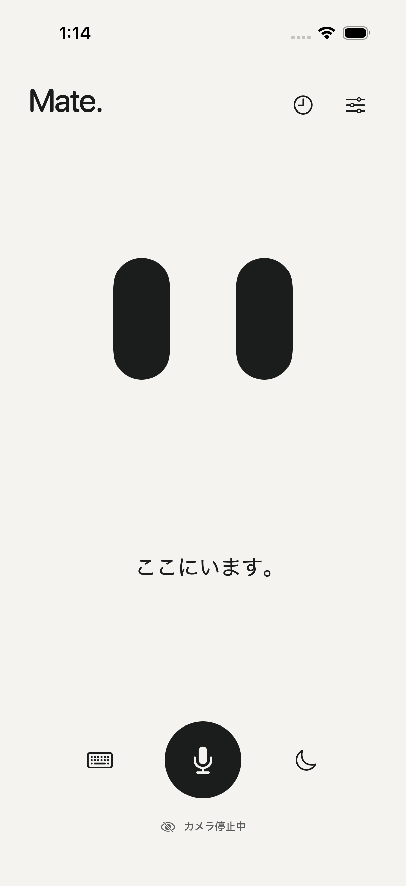
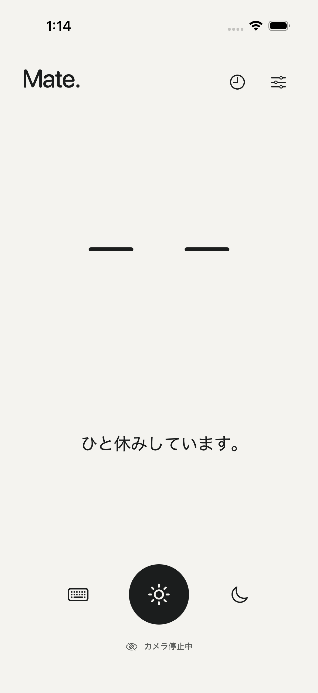
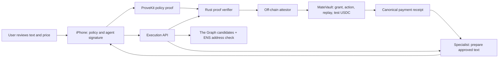

# ZeroKey Mate

**Your companion. Your rules.**

A private iPhone companion that proves each paid AI request follows your rules.

Mate is designed to keep everyday conversation on your iPhone. When you ask a specialist to translate or summarize something, you review the exact text, provider, recipient and price first. A ProveKit proof checks the request against your private spending policy; a narrowly scoped Ethereum vault enforces the signed execution. The language model has no authority to approve a payment.

[日本語](docs/README.ja.md) · [Demo guide](docs/demo.md) · [Submission copy](docs/submission.md) · [Architecture](docs/architecture.md) · [Validation](docs/validation.md)

<p align="center">
  
  
</p>

<p align="center"><em>Actual iOS Simulator captures: home → Rest. These screens do not demonstrate live conversation, DockKit tracking or a payment. <a href="docs/assets/README.md">Capture provenance</a>.</em></p>

## The moment we want to make possible

“Translate this meeting note, but only within the rules I approved.”

1. **Set your rules.** Approve a versioned mandate for a dedicated agent wallet, a budget, allowed services and an expiry.
2. **Choose what leaves the phone.** Review the text and a specialist's current quote. The conversation history is not attached.
3. **Prove and execute.** Prove that this specific request fits the committed policy. Verify the proof, owner grant and agent signature before transferring test USDC.
4. **Get the result, even after a disconnect.** Recover the same signed request and receipt. Retrying a completed request cannot spend again.

The local acceptance test exercises steps 3–4 with a real proof, HTTP services and Solidity contracts. The complete iPhone-to-public-Sepolia flow still needs live acceptance.

## Why Ethereum and zero knowledge?

An assistant's instructions are not a spending boundary. MateVault checks authority, expiry, revocation, spend state and replay on chain. Each action binds the chain, vault, mandate, concrete recipient, amount, service, disclosed text hash and nonce. The vault supports one configured token and a fixed transfer operation.

The proof keeps the policy's budget, allowed-service mask and salt out of the public grant. The payment amount and recipient remain public; the specialist receives the text you approve. A human-readable ENS name helps select a recipient but cannot authorize spending.

**Trust boundary:** ProveKit verification runs off chain. MateVault trusts the configured attestor's signature on its result. A compromised attestor can approve a policy violation; collusion with the agent can spend beyond the private budget. This is not an on-chain ZK verifier. See the [full trust assumptions](docs/architecture.md#trust-assumptions).

## What works today

| Component | Evidence | Remaining acceptance |
| --- | --- | --- |
| Native SwiftUI app | iOS Simulator/device SDK builds; CI exercises real screens and Keychain | Physical iPhone, camera, microphone, Foundation Models and DockKit |
| ProveKit + Noir policy circuit | Real proof generation/verification, six invalid-witness rejections and API tamper tests | Proof generation latency and memory on the target iPhone |
| MateVault | 12 contract tests on Anvil, including replay and authorization failures | Public Sepolia deployment and live receipts |
| API + specialist + recovery | Real proof → HTTP → vault → result, including API restart and retry without duplicate spend | Complete mobile/live-service flow |
| Local specialist model | Actual Ollama translation and recovery checked locally | A separately configured, license-reviewed deployment |
| Privy | Pinned iOS SDK and signing adapter compile | Live login and owner/agent signing |
| ENSv2 + The Graph | Registration/resolution and discovery adapters implemented | Live registry, index schema, provider records and queries |

**Current scope: a working local prototype, with further app implementation and hardware/live acceptance still open.** The [product backlog](https://github.com/susumutomita/ZeroKeyMate/issues/4) includes unified cancellation of pending operations, a full-stack launcher, runtime pairing, broader conversation actions and expressive stand motion. Basic continuous voice is implemented, but its full acceptance criteria are not closed. [Implementation status](docs/validation.md#remaining-product-implementation).

Anvil payments are simulations. Default local discovery and model responses are labeled fixtures; the optional Ollama mode generates a real response. No unavailable integration is replaced by a success screen. [Detailed results](docs/validation.md).

## Run the app

Use an Apple Silicon Mac, Xcode 26 or later with an iOS Simulator runtime, and Node.js 22.16+ on the 22.x line or Node.js 24.x. Open Xcode once to finish its setup. The scripts install a checksum-pinned XcodeGen inside this project.

The current review build is in [PR #12](https://github.com/susumutomita/ZeroKeyMate/pull/12). Until it is merged, check out its branch:

```sh
git clone --branch codex/complete-local-runtime https://github.com/susumutomita/ZeroKeyMate.git
cd ZeroKeyMate
npm ci --ignore-scripts
npm run configure
make test
make build-ios
./mate --simulator
```

`configure` creates an ignored `.env` containing local pairing/journal keys and preserves an existing file. It does not create wallets, fund an account or deploy contracts. A fresh clone can open the UI without payment credentials. Source-only builds explicitly disable proving and paid execution until the real runtime and circuit are built.

The UI is currently Japanese. Keyboard opens conversation, microphone starts speech, moon stops camera/microphone and rests, sliders open settings, and clock opens activity. On-device conversation requires an eligible Apple Intelligence device/model; unavailable models are reported without a cloud fallback.

For a physical iPhone, run `make project`, open `apps/ios/ZeroKeyMate.xcodeproj`, select your Signing Team and run. DockKit requires compatible physical hardware. Detailed configuration is in [setup (日本語)](docs/setup.md) and [`.env.example`](.env.example).

## Reproduce the proof and payment demo

Install Rust/rustup and Foundry with `anvil` available on PATH. Dependency versions, public sources and licenses are recorded in [SOURCES](docs/SOURCES.md). No model is downloaded automatically.

```sh
make test-contracts
make proofs
cargo +nightly-2026-03-04 build --release --locked --manifest-path services/verifier/Cargo.toml
npm run test:proofs
npm run test:local
```

This generates an actual proof and exercises the execution/recovery protocol on a disposable Anvil chain. It uses published test accounts and a test token; it is **local payment simulation**, not public Sepolia. See the [demo guide](docs/demo.md) for the real-model option, rejection checks and a three-minute walkthrough.

To include ProveKit in the iOS app and run native acceptance on a usable Simulator:

```sh
make native-runtime
make build-ios
./mate --verify
```

Normal setup builds from pinned public sources, without relying on expiring CI artifacts. Host restrictions that prevent circuit preparation or Simulator access must be resolved before those checks can run; an SDK build is not a runtime test.

## How it fits together



The Graph and ENS paths require live configuration; local acceptance substitutes explicitly labeled discovery fixtures. The specialist independently checks the payment event before releasing its result. Settlement is not escrow: provider failure after payment has no automatic refund.

| Code | Responsibility |
| --- | --- |
| [`apps/ios`](apps/ios) | Companion UI, sensor consent, local conversation, signing and recovery |
| [`Sources/MateCore`](Sources/MateCore) | Versioned policy/action encoding and receipt validation |
| [`circuits`](circuits) | Private-policy compliance circuit |
| [`services/api`](services/api) | Discovery, proof verification, execution and encrypted journal |
| [`services/provider`](services/provider) | Ollama specialist, encrypted prepared result, independent payment check |
| [`services/verifier`](services/verifier) | Real ProveKit verification and public-input extraction |
| [`contracts`](contracts) | MateVault and ENS address resolver |

## Consent, sources and submission

Camera and microphone require explicit starts. Docking alone starts no recording, upload or payment. Stop remains effective during startup; backgrounding, interruptions and detach stop capture. Returning foreground or re-docking does not restore consent. Camera OFF is reported only after the service stops. Camera-intent transitions have unit coverage; physical behavior remains on the [device checklist](docs/device-checklist.md).

No audio recordings, camera frames or conversation history are uploaded. Approved specialist text/results are stored in encrypted server journals whose operators hold the keys. ProveKit proves policy compliance; it does not encrypt media or establish real-world identity. Production funds and identity-card support are outside this prototype.

For ETHGlobal review: [submission copy and open fields](docs/submission.md), [demo script](docs/demo.md), and [development history / AI assistance](docs/development-history.md). Event, track, prize eligibility and the final demo video are still to be confirmed. Existing commits are disclosed rather than represented as work from an unconfirmed event window.

Original project code is licensed under [Apache-2.0](LICENSE). Public sources and reviewed dependency licenses are in [SOURCES](docs/SOURCES.md) and [third-party notices](docs/THIRD_PARTY_NOTICES.txt). This provenance record is not a formal clean-room audit.
