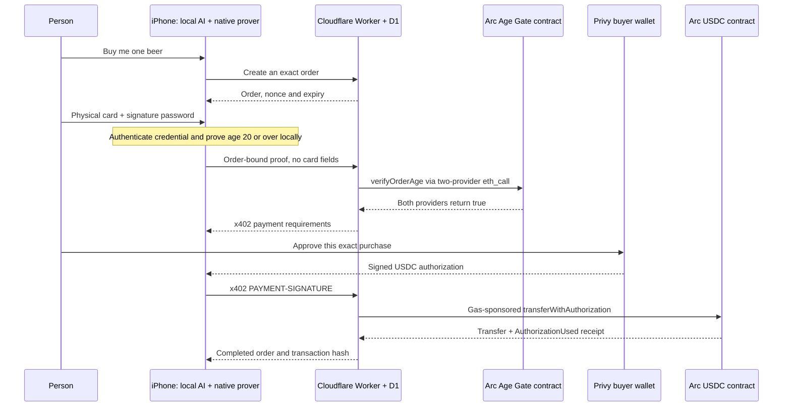

# ZeroKey Mate

**Your companion. Your rules.**

An iPhone companion that helps you buy something without giving the store your identity document. Ask Mate for a beer. Your phone authenticates a physical Japanese My Number card, proves locally that you are at least 20, and sends the proof to the store. After verification and your exact payment approval, a Privy wallet pays **0.10 test USDC through x402 on Arc Testnet**.

**A physical-card test purchase completed on September 13, 2026.** The iPhone showed **12.0 seconds** of local age-proof processing. Both configured Arc RPC providers confirmed the payment. The 12.0-second timing is one observation, not a general benchmark. Further purchases completed; five separate transfers were verified through both configured RPC providers. Checkout reliability is still being improved. The current source adds [local proof timing details](docs/age-proof-timing.md) to distinguish setup, witness/proof processing and verification; this does not claim a speedup or WHIR support.

[Project demo and walkthrough](https://zerokeymate-arc-shop.oyster880.workers.dev/demo/) · [Open the store](https://zerokeymate-arc-shop.oyster880.workers.dev/) · [View the confirmed purchase](https://testnet.arcscan.app/tx/0xfe77313324c3438cfc935dd87c14efe56bc6f3a1a4a4150a9ee661c045856eb3) · [Deployment and evidence](docs/arc-live-status.md) · [Watch the 3:27 film](services/shop/public/demo/assets/submission.mp4) · [Pitch deck PDF](docs/presentation/ZeroKeyMate-pitch.pdf) · [Narration and editing notes](docs/demo.md) · [Submission copy](docs/submission.md)

The submitted film combines the creator's own recorded voice, English subtitles, technical slides and fifty seconds of edited device footage at original speed. [Submission assets](docs/presentation/README.md) include the film, subtitle file, pitch PDF and original visual assets.

**Development after submission (September 21, 2026):** the public store now offers
beer and sparkling water, one to five bottles of a single product. Water costs
0.05 test USDC per bottle and needs no card scan; beer retains its age check.
The updated catalogue and bilingual conversation code are included in iPhone
build 14, together with the native age prover, local timing details, conversation
error recovery and catalogue receipt validation. The
launcher now rejects shop bundles missing that runtime or its pinned setup.
The new catalogue still needs a fresh physical-device purchase check;
the successful transactions above are evidence for the earlier beer flow.
The [atomic catalogue budget](docs/catalogue-budget.md) is separate local-chain
research with real synthetic-credential ZK acceptance, not unattended payments
enabled in the app. All of this is pre-Tokyo work.

[External x402 infrastructure](docs/external-x402.md) now validates a restricted
Arc/USDC profile and preserves unresolved signatures across network failure.
It is not connected to a wallet or purchase UI yet; independent settlement and
service-delivery recovery still need integration before it can be enabled.

## The experience

1. Open Mate on a compatible iPhone. Tap the resting face to start the companion. A DockKit stand can follow the detected face; the stand is optional for purchasing.
2. Say **“Buy me one beer.”** The on-device model proposes the supported item. Deterministic code checks the store, wallet and available test USDC before creating an order.
3. Enter the card's **6–16-character signature password**, then tap the physical My Number card. Camera capture stops before NFC starts. The four-digit card PIN is a different credential.
4. The iPhone authenticates the signed card credential and creates an order-bound age proof locally. The store checks it with the deployed Age Gate contract.
5. Approve the exact **0.10 test-USDC** payment. The merchant sponsors network gas. Mate waits for the actual receipt and provides an **Arc Explorer** link.

The successful purchase began from the screen. The user also confirmed that a voice request opens checkout; the supplied 58.5-second video combines successful recorded takes and is not claimed as an uncut same-order recording. A transient store-readiness failure was reproduced on the physical iPhone and addressed with bounded retries of public network reads. Those retries cannot sign or submit a payment.

**English:** use the globe menu at the upper left of the purchase screen and choose **English**. The same menu is available after swiping up on Mate's face. It switches display and future purchase narration together and persists across launches. The phone's system language does not need to change. Settings can configure display and speech separately. Each English/Japanese message selects its reply language; this is not simultaneous bilingual recognition.

No real money is charged and no beer is delivered. The app supports the **physical card** in this flow; Apple Wallet's smartphone My Number card, World ID and unattended payment permissions are not integrated.

## Why this matters

An age check usually asks a person to reveal an identity document or personal details. Mate separates the fact the shop needs — **age 20 or over** — from the underlying identity data. The companion stays conversational while code controls the sensitive steps.

The local model handles conversation and proposes actions. It never receives the card password, certificate, date of birth, order capability or signing interface. A request to buy does not authorize arbitrary browsing or arbitrary spending: checkout supports one configured shop, two canonical products and one to five bottles of a single product per order. Code resolves the exact amount before the owner approves payment.

## How it works



The shop's Durable Object serializes sponsor transactions and persists signed transaction bytes before broadcast. An uncertain payment remains the same pending order. A hash alone is not success: the shop and phone check the actual receipt, amount, recipient and authorization nonce.

**Trust boundary:** the Worker verifies the age proof with the deployed contract before fulfilling the purchase. Age verification is an `eth_call`, not a separate on-chain transaction. The USDC transfer does not atomically invoke the age gate. This is an Age Gate, **not a permission validator**. Agreement between the two RPC providers is an explicit trust assumption.

## What stays private

| Stays on the iPhone in this purchase flow | Leaves the iPhone |
| --- | --- |
| Camera frames and everyday conversation processing | The selected order and public order commitments |
| Card PIN, signed certificate, card signature, name, address and birth date | The order-bound age proof and public proof inputs |
| Private witness used by the prover | Buyer/merchant addresses, amount and payment authorization |

Card material is not logged, stored in the order or uploaded. Authenticated card input remains in memory only for the current proof/retry window and is discarded on completion, cancellation, backgrounding or expiry. Privy authentication and payments use network services; the complete product is not offline. Payments remain public and linkable. This is not anonymous delivery.

The age prover uses a pinned **experimental ProveKit Groth16 branch**, an EVM exporter and a reviewed masking patch. The setup is single-party and certificate revocation is not checked. This is a testnet prototype, not production identity assurance. The separate private-spending-policy ProveKit exercise is a different circuit and must not be used as age-proof performance evidence. See [the card-policy fix](docs/card-proof-policy-fix.md) and [sources/licenses](docs/SOURCES.md).

## Verified status

| Capability | Current evidence |
| --- | --- |
| Physical card → local age proof → Arc purchase | Multiple test purchases completed; [confirmed transaction](https://testnet.arcscan.app/tx/0xfe77313324c3438cfc935dd87c14efe56bc6f3a1a4a4150a9ee661c045856eb3), block 61889554 |
| Local proving | 12.0 s shown for that purchase; actual native prover and invalid-input rejection also tested on iPhone |
| Voice purchase entry | User confirmed that “buy beer” opens checkout; edited physical-device footage is available; an uncut same-order recording is not claimed |
| English/Japanese | In-place purchase-screen switching and persistence tested; user supplied the English physical-phone screen |
| Privy | Embedded buyer wallet and exact EIP-712 signing are wired into the completed purchase |
| Arc / x402 | Live testnet settlement, receipt and explorer link; no mainnet deployment |
| Two-product catalogue | Public Worker and iPhone build 14 updated; canonical amounts and receipt checks cover both products at quantities 1–5. Fresh physical purchase acceptance remains pending. |
| Conversation recovery | [Physical model evidence and scope](docs/conversation-device-status.md): short Japanese recall passed; a benign language-switch turn hit a guardrail. Build 14 contains recovery without retrying or putting Mate to sleep. |
| External x402 services | [Unconnected infrastructure](docs/external-x402.md): restricted challenge/receipt validation and persistent retries tested with fixtures. No external purchase, wallet integration or settlement reconciliation is claimed. |
| Atomic spending permissions | [Local-only contract](docs/catalogue-budget.md): real ZK, canonical SKU/age, shared budget/count, replay, revocation and transfer rollback tested. Not deployed or connected to x402/native delegation. |
| The Graph | Arc purchase-history Subgraph source is merged; Studio deployment and a live data-driven purchase decision remain incomplete |
| Smartphone My Number card / World ID / delegated wallet | Not integrated into this checkout |

[Partner requirement matrix](docs/prize-strategy.md) distinguishes implementation evidence from prize eligibility. There is no claim that all three partner targets have been achieved.

## Partner prize evidence: where to review the integration

The completed purchase supports **Arc — Best DeFi/Onchain Finance Application** and **Privy — Best financial flow** as the current application targets. This table maps those targets to actual code and public testnet evidence; it does not guarantee eligibility or an award.

| Partner / target | Role in the demonstrated purchase | Code to inspect | Evidence / current boundary |
| --- | --- | --- | --- |
| **Arc — DeFi/Onchain Finance** | Deployed age verifier/gate and real USDC settlement with merchant-sponsored gas | [MateAgeGate.sol](contracts/src/MateAgeGate.sol), [two-provider age checks](services/shop/src/age-rpc.mjs), [x402 checkout and receipt checks](services/shop/src/worker.mjs), [Arc settlement](services/shop/src/settlement.mjs), [durable sponsor queue](services/shop/src/settlement-queue.mjs) | Contracts below; [first actual payment](https://testnet.arcscan.app/tx/0xfe77313324c3438cfc935dd87c14efe56bc6f3a1a4a4150a9ee661c045856eb3). The Worker enforces age before fulfillment; verification is separate from the USDC transfer. Circle Agent Stack is not used in this checkout. |
| **Privy — Best financial flow** | Embedded buyer wallet authenticates the user and signs the exact EIP-712 authorization after approval | [WalletService.swift](apps/ios/ZeroKeyMate/WalletService.swift), [ShopCheckout.swift](apps/ios/ZeroKeyMate/ShopCheckout.swift), [payment protocol](services/shop/src/protocol.mjs) | The confirmed purchase used the buyer wallet and real test USDC. Approval remains explicit and scoped to one purchase. |
| **The Graph — not ready to claim** | Prepared Arc transfer/authorization indexing; intended to inform a future local spending decision | [Subgraph source](integrations/graph-arc), [Graph integration guide](integrations/graph-arc/README.md) | Source is merged and tested. Studio deployment, a live query and a meaningful agent decision from that query are not complete. |
| **ProveKit — core technical contribution** | Local age proof from authenticated My Number card data, using World Foundation's proving toolkit | [Noir age circuit](circuits/jpki_age/src/main.nr), [native age proving](apps/ios/ZeroKeyMate/AgeProofService.swift), [pinned source manifest](config/age-proof-sources.json) | Physical-iPhone proving and purchases demonstrated. This is not World ID authentication or evidence of an AgentKit/Selfie Check integration. |

### Public Arc Testnet coordinates

Network **Arc Testnet**, chain ID **5042002**. All addresses and transactions below are public testnet data.

| Component | Explorer address | Code / reproducibility |
| --- | --- | --- |
| Government-root Age Gate | [0x0f6c1de47a91a08b0c5854e7bb2173eea687cde9](https://testnet.arcscan.app/address/0x0f6c1de47a91a08b0c5854e7bb2173eea687cde9) | [MateAgeGate.sol](contracts/src/MateAgeGate.sol) binds the trusted root, order and proof |
| Age proof verifier | [0xb66c1e5d4afb1f1be6025ef85df0220e48fa7f20](https://testnet.arcscan.app/address/0xb66c1e5d4afb1f1be6025ef85df0220e48fa7f20) | Generated for the pinned Noir/ProveKit setup; [artifact and runtime hashes](docs/arc-live-status.md), [policy-fix record](docs/card-proof-policy-fix.md) |
| Arc USDC | [0x3600000000000000000000000000000000000000](https://testnet.arcscan.app/address/0x3600000000000000000000000000000000000000) | Existing network token; [exact authorization and domain checks](services/shop/src/protocol.mjs) |
| Test merchant / gas sponsor | [0x9A46479e2c1CFda09cb91b12283CcCe03322E6B9](https://testnet.arcscan.app/address/0x9A46479e2c1CFda09cb91b12283CcCe03322E6B9) | Dedicated test account used by the [settlement queue](services/shop/src/settlement-queue.mjs) |

The [receipt table](docs/arc-live-status.md) records five independently checked buyer payments, rather than deployment or funding transactions. The age check uses `verifyOrderAge` through `eth_call`: it does not produce a separate age-verification transaction. The payment transaction contains the real USDC transfer and authorization-use events. See [the prize matrix](docs/prize-strategy.md) for official requirements and remaining submission work.

## Run and validate

Use an Apple Silicon Mac, Xcode 26 with an iOS runtime, and a supported Node.js version (22.16+ on the 22.x line, or 24.x).

```sh
git clone https://github.com/susumutomita/ZeroKeyMate.git
cd ZeroKeyMate
npm ci --ignore-scripts
make test
make start-simulator
```

`make start-device` builds, signs, installs and opens the app on a paired iPhone. Enable Developer Mode and unlock it. Xcode can transfer over a paired wireless connection on the same network; a data-capable USB cable is a fallback. If multiple phones or teams are available, supply `MATE_DEVICE_UDID` and `MATE_DEVELOPMENT_TEAM` explicitly. Never uninstall the working app merely to refresh its build.

A fresh source-only build can show the UI but honestly disables native proving. The installed acceptance build includes the matching native runtime, age proving/verifying resources, public shop coordinates and Privy configuration. Reproducing the paid path requires those prerequisites and test USDC; cloning does not create accounts, import keys or deploy contracts. Follow [native proof setup](docs/device-proof-evidence.md), [shop/setup commands](services/shop/README.md) and [Arc architecture](docs/arc-checkout.md).

```sh
make build-ios
make test-ios
cd services/shop
npm ci --ignore-scripts
npm test
npm run build
```

Core regression checks pass; 51 shop tests include transient/persistent readiness failure, fee caps, exact authorization and no duplicate signing. Build 7 passed 26 selected simulator tests and five physical-phone native/readiness tests. Build 8 passed the purchase-language interaction/persistence test. The [evidence page](docs/arc-live-status.md) records scope and remaining device checks; builds and tests alone do not establish physical purchases.

Camera and microphone start explicitly. Say **“good night”** or **“おやすみ”**, or use Rest in Controls, to stop the companion. Backgrounding or detaching a connected stand stops capture; returning does not silently restart it. Mounting/charging alone does not launch the app. A user-configured Shortcuts charger automation can open Mate, but is separate from sensor consent.

## Code and provenance

| Area | Role |
| --- | --- |
| [iOS app](apps/ios/ZeroKeyMate) | Companion, local model, NFC, native proving, Privy and checkout |
| [MateCore](Sources/MateCore) | Signed-card validation and shared protocol boundaries |
| [Age circuit](circuits/jpki_age) | Signed credential, age threshold and order binding |
| [Shop](services/shop) | Workers storefront, x402 API, D1 recovery and sponsor queue |
| [Contracts](contracts) | Deployed age verifier/gate and separate experimental wallet work |
| [Graph index](integrations/graph-arc) | Prepared Arc payment-history mapping; not live yet |

The older specialist translation/private-policy vault is a separate local prototype. Its [architecture](docs/architecture.md), [local setup](docs/setup.md) and [validation](docs/validation.md) are retained; its fixture discovery and Anvil receipts do not describe the live beer checkout.

The human directed the product, privacy constraints, physical-card testing and deployment approvals. Codex assisted with implementation, debugging, tests and documentation; ChatGPT assisted with public technical research. [Development and AI attribution](docs/development-history.md) records known history and reused work. The public MIT-licensed [CircuitBreaker NFC module](https://github.com/knocks-public/2024-CircuitBreaker) is an attributed source, not a new invention. No event eligibility is inferred from a dependency license.

Original project code is [Apache-2.0](LICENSE); retain [third-party notices](docs/THIRD_PARTY_NOTICES.txt). The human-narrated 3:27 submission film, English technical slides, pitch PDF and public visual assets are included. The entrant reported successful ETHOnline submission on September 13, 2026.
